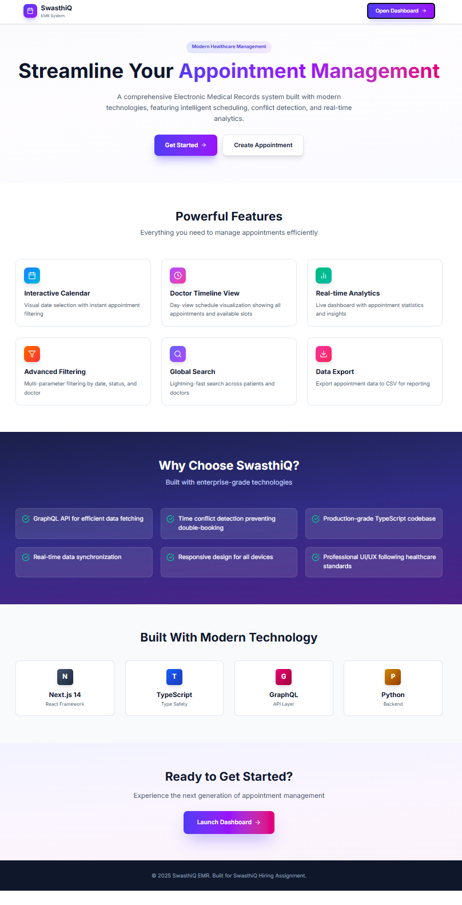
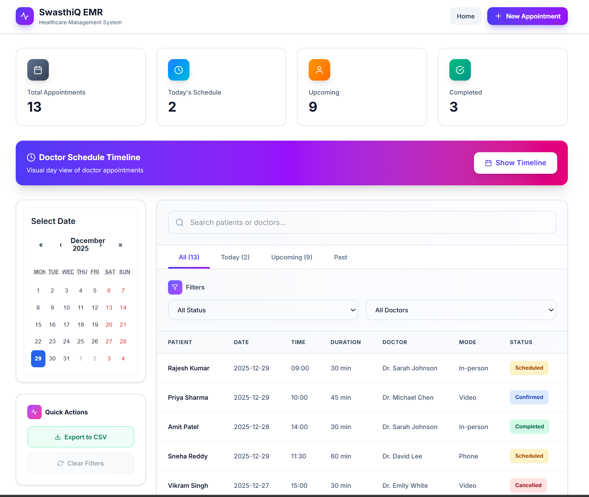
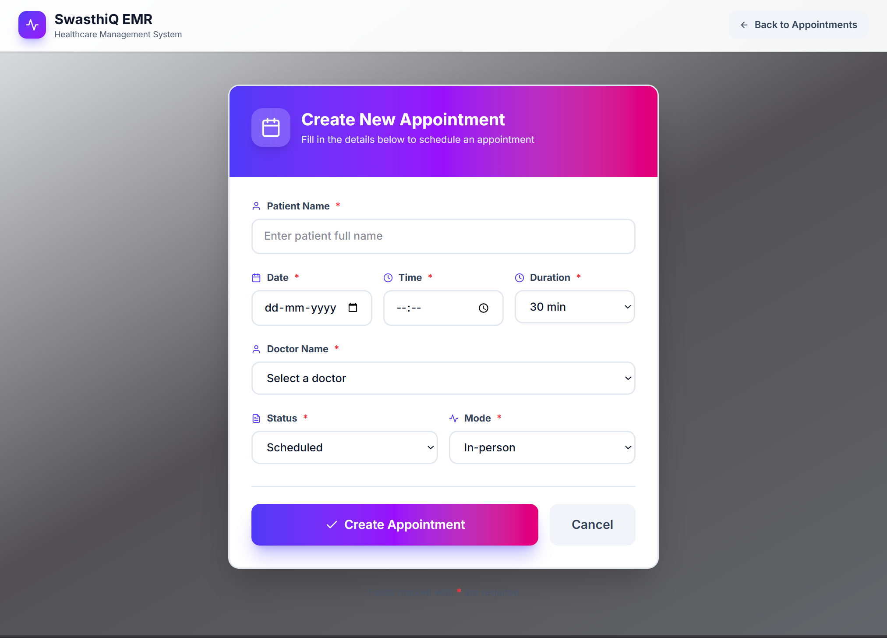
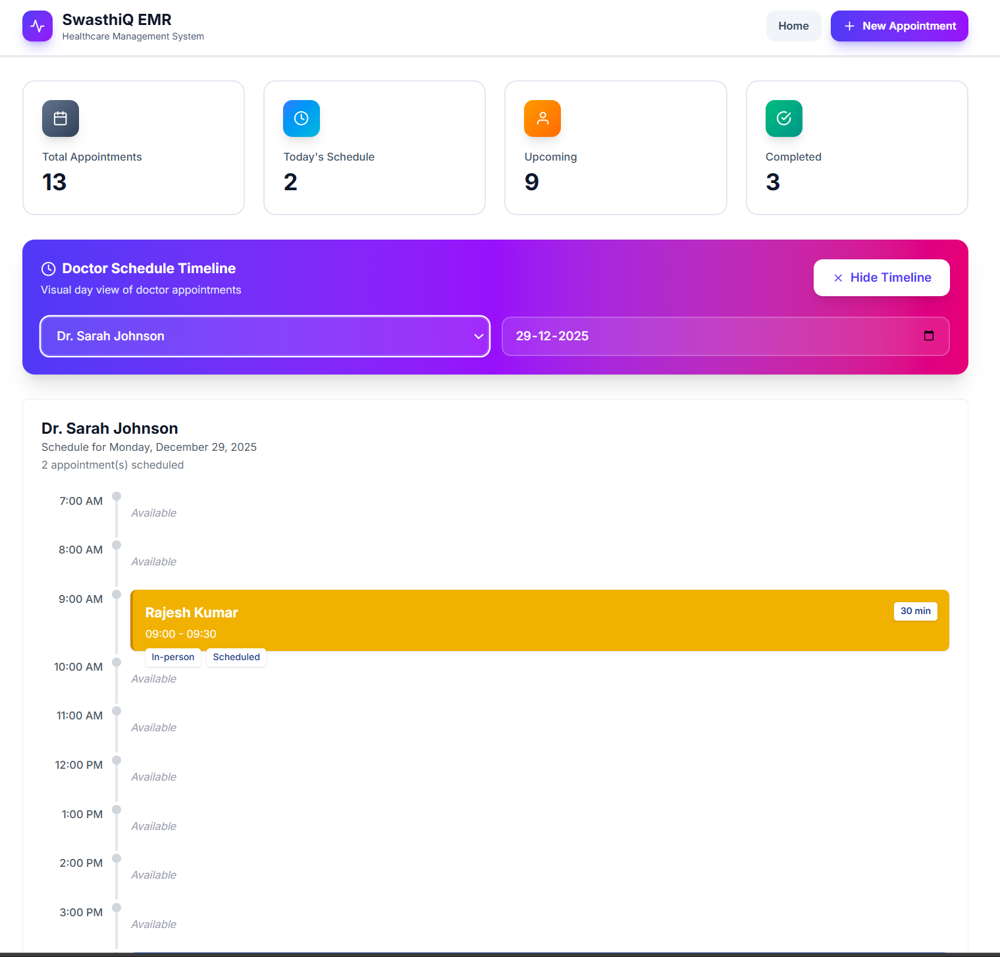

#  SwasthiQ EMR - Healthcare Appointment Management System

> A modern, production-ready Electronic Medical Records (EMR) system built with Next.js 14, FastAPI, GraphQL, and TypeScript.

[](https://swasthiq-emr-assignment.vercel.app/)
[](https://swasthiq-emr-assignment-production.up.railway.app/)
[](https://github.com/Yashwanth2408/swasthiq-emr-assignment)

---

## 🚀 Live Demo

**Frontend:** [https://swasthiq-emr-assignment.vercel.app/](https://swasthiq-emr-assignment.vercel.app/)

**Backend API:** [https://swasthiq-emr-assignment-production.up.railway.app/graphql](https://swasthiq-emr-assignment-production.up.railway.app/graphql)

**GraphQL Playground:** [https://swasthiq-emr-assignment-production.up.railway.app/graphql](https://swasthiq-emr-assignment-production.up.railway.app/graphql)

---

## ✨ Features

### 🎯 Core Functionality
- **Complete CRUD Operations** - Create, Read, Update, Delete appointments
- **Advanced Filtering** - Filter by date, doctor, status with real-time updates
- **Global Search** - Lightning-fast search across patients and doctors
- **Interactive Calendar** - Visual date selection with appointment highlighting
- **Doctor Timeline View** - Day-view schedule visualization for doctors
- **Time Conflict Detection** - Prevents double-booking automatically
- **CSV Export** - Export appointment data for reporting

### 🎨 User Experience
- **Responsive Design** - Works seamlessly on desktop, tablet, and mobile
- **Modern UI/UX** - Beautiful gradients, animations, and micro-interactions
- **Real-time Updates** - Instant feedback on all operations
- **Error Handling** - Comprehensive error messages and validation
- **Loading States** - Smooth loading indicators and skeleton screens

### 🔧 Technical Excellence
- **Type-Safe** - Full TypeScript implementation across frontend and backend
- **GraphQL API** - Efficient data fetching with precise queries
- **Production Deployment** - Fully deployed on Vercel and Railway
- **Code Quality** - Clean, maintainable, and well-documented code
- **Performance Optimized** - Fast load times and smooth interactions

---

## 🛠️ Tech Stack

### Frontend
- **Framework:** Next.js 14 (App Router)
- **Language:** TypeScript
- **Styling:** Tailwind CSS
- **State Management:** Apollo Client
- **Animations:** Framer Motion
- **Icons:** React Icons (Feather Icons)
- **Data Fetching:** Apollo Client with GraphQL

### Backend
- **Framework:** FastAPI (Python)
- **API:** GraphQL with Strawberry
- **Server:** Uvicorn (ASGI)
- **Data Validation:** Pydantic
- **CORS:** FastAPI CORS Middleware

### Deployment
- **Frontend:** Vercel (Edge Network, CDN)
- **Backend:** Railway (Container-based deployment)
- **Version Control:** GitHub

---

## 📐 System Architecture

```
┌─────────────────────────────────────────────────────────────┐
│                        CLIENT LAYER                          │
│  ┌───────────────────────────────────────────────────────┐  │
│  │  Next.js 14 Frontend (Vercel Edge Network)           │  │
│  │  - React Components with TypeScript                   │  │
│  │  - Tailwind CSS for styling                          │  │
│  │  - Apollo Client for GraphQL                         │  │
│  │  - Framer Motion for animations                      │  │
│  └───────────────────────────────────────────────────────┘  │
└─────────────────────────────────────────────────────────────┘
                            │
                            │ HTTPS / GraphQL
                            ▼
┌─────────────────────────────────────────────────────────────┐
│                      API GATEWAY LAYER                       │
│  ┌───────────────────────────────────────────────────────┐  │
│  │  FastAPI + GraphQL (Railway)                         │  │
│  │  - Strawberry GraphQL Schema                         │  │
│  │  - Request Validation & Authentication               │  │
│  │  - CORS Configuration                                │  │
│  └───────────────────────────────────────────────────────┘  │
└─────────────────────────────────────────────────────────────┘
                            │
                            │
                            ▼
┌─────────────────────────────────────────────────────────────┐
│                     BUSINESS LOGIC LAYER                     │
│  ┌───────────────────────────────────────────────────────┐  │
│  │  GraphQL Resolvers                                    │  │
│  │  - Query: appointments, appointment                   │  │
│  │  - Mutation: create, update, delete                  │  │
│  │  - Time Conflict Detection Algorithm                 │  │
│  │  - Data Validation Logic                             │  │
│  └───────────────────────────────────────────────────────┘  │
└─────────────────────────────────────────────────────────────┘
                            │
                            │
                            ▼
┌─────────────────────────────────────────────────────────────┐
│                       DATA LAYER                             │
│  ┌───────────────────────────────────────────────────────┐  │
│  │  In-Memory Data Store (Mock Database)                │  │
│  │  - Simulates Aurora PostgreSQL                       │  │
│  │  - 13 Sample Appointments                            │  │
│  │  - Production: Would use AWS Aurora PostgreSQL       │  │
│  └───────────────────────────────────────────────────────┘  │
└─────────────────────────────────────────────────────────────┘
```

---

## 🗂️ Project Structure

```
swasthiq-emr-assignment/
├── frontend/                    # Next.js Frontend Application
│   ├── app/
│   │   ├── appointments/       # Appointments pages
│   │   │   ├── [id]/edit/     # Edit appointment page
│   │   │   ├── new/           # Create appointment page
│   │   │   └── page.tsx       # Main appointments dashboard
│   │   ├── landing/           # Landing page
│   │   ├── layout.tsx         # Root layout
│   │   ├── page.tsx          # Home page (redirects)
│   │   ├── globals.css       # Global styles
│   │   ├── calendar.css      # Calendar-specific styles
│   │   └── ApolloWrapper.tsx # Apollo Client provider
│   ├── components/
│   │   ├── Calendar.tsx      # Interactive calendar widget
│   │   └── DoctorTimeline.tsx # Doctor schedule timeline
│   ├── lib/
│   │   ├── graphql/
│   │   │   ├── client.ts     # Apollo Client configuration
│   │   │   └── operations.ts # GraphQL queries/mutations
│   │   └── types.ts          # TypeScript type definitions
│   ├── public/               # Static assets
│   ├── .env.local           # Environment variables (not in git)
│   ├── package.json
│   ├── tsconfig.json
│   └── tailwind.config.ts
│
├── backend/                     # FastAPI Backend Application
│   ├── main.py                 # Main FastAPI application
│   ├── requirements.txt        # Python dependencies
│   └── runtime.txt            # Python version specification
│
├── .gitignore
└── README.md                   # This file
```

---

## 🚀 Getting Started

### Prerequisites
- **Node.js** 18+ and npm/yarn
- **Python** 3.11+
- **Git**

### 1. Clone the Repository
```
git clone https://github.com/Yashwanth2408/swasthiq-emr-assignment.git
cd swasthiq-emr-assignment
```

### 2. Backend Setup

```
# Navigate to backend directory
cd backend

# Install dependencies
pip install -r requirements.txt

# Run the development server
uvicorn main:app --reload --port 8000
```

Backend will be available at: `http://localhost:8000`  
GraphQL Playground: `http://localhost:8000/graphql`

### 3. Frontend Setup

```
# Navigate to frontend directory
cd frontend

# Install dependencies
npm install
# or
yarn install

# Create environment file
cp .env.example .env.local

# Update .env.local with your backend URL
NEXT_PUBLIC_GRAPHQL_ENDPOINT=http://localhost:8000/graphql

# Run the development server
npm run dev
# or
yarn dev
```

Frontend will be available at: `http://localhost:3000`

---

## 📡 API Documentation

### GraphQL Endpoints

#### Queries

**Get All Appointments**
```
query {
  appointments(
    date: "2025-12-29"        # Optional: filter by date
    status: "Scheduled"       # Optional: filter by status
    doctorName: "Dr. Sarah Johnson"  # Optional: filter by doctor
  ) {
    id
    patientName
    date
    time
    duration
    doctorName
    status
    mode
  }
}
```

**Get Single Appointment**
```
query {
  appointment(id: "1") {
    id
    patientName
    date
    time
    duration
    doctorName
    status
    mode
  }
}
```

#### Mutations

**Create Appointment**
```
mutation {
  createAppointment(
    input: {
      patientName: "John Doe"
      date: "2025-12-30"
      time: "10:00"
      duration: 30
      doctorName: "Dr. Sarah Johnson"
      status: "Scheduled"
      mode: "In-person"
    }
  ) {
    id
    patientName
    date
    time
  }
}
```

**Update Appointment**
```
mutation {
  updateAppointment(
    id: "1"
    input: {
      patientName: "John Doe Updated"
      date: "2025-12-30"
      time: "11:00"
      duration: 45
      doctorName: "Dr. Sarah Johnson"
      status: "Confirmed"
      mode: "Video"
    }
  ) {
    id
    patientName
    status
  }
}
```

**Delete Appointment**
```
mutation {
  deleteAppointment(id: "1") {
    success
    message
  }
}
```

---

## 🔥 Key Features in Detail

### 1. Time Conflict Detection

The system automatically prevents double-booking by checking for time overlaps:

```
def check_time_conflict(doctor_name: str, date: str, time: str, duration: int):
    """
    Checks if new appointment conflicts with existing ones
    Algorithm: (StartA < EndB) AND (EndA > StartB)
    """
    # Returns True if conflict exists
```

**Example:**
- Existing: Dr. Sarah Johnson, 10:00-10:30
- New: Dr. Sarah Johnson, 10:15-10:45
- Result: ❌ Conflict detected, appointment blocked

### 2. Advanced Filtering

Multiple filters can be combined:
- **By Date** - Show appointments for specific day
- **By Status** - Scheduled, Confirmed, Completed, Cancelled
- **By Doctor** - View specific doctor's appointments
- **Search** - Real-time search across patients and doctors

### 3. Doctor Timeline View

Visual representation of doctor's daily schedule:
- Hourly timeline (8 AM - 8 PM)
- Color-coded appointment blocks
- Shows appointment duration visually
- Easy identification of free slots

---

## 🎨 UI Screenshots

### Landing Page


### Dashboard


### Create Appointment


### Doctor Timeline


---

## 🧪 Testing

### Test Accounts
The system comes pre-loaded with 13 sample appointments featuring:
- 5 doctors
- Various appointment types (In-person, Video, Phone)
- Different statuses and dates

### Manual Testing Checklist
- ✅ Create new appointment
- ✅ View all appointments
- ✅ Filter by date, status, doctor
- ✅ Search functionality
- ✅ Edit existing appointment
- ✅ Delete appointment
- ✅ Time conflict detection
- ✅ Calendar date selection
- ✅ Doctor timeline view
- ✅ Export to CSV

---

## 🚀 Deployment

### Frontend (Vercel)
```
# Automatic deployment on push to main branch
# Environment variables required:
NEXT_PUBLIC_GRAPHQL_ENDPOINT=https://your-backend-url.railway.app/graphql
```

### Backend (Railway)
```
# Automatic deployment on push to main branch
# Root Directory: backend
# Start Command: uvicorn main:app --host 0.0.0.0 --port $PORT
# Environment variables:
ENVIRONMENT=production
```

---

## 🔮 Future Enhancements

### Phase 1 (Immediate)
- [ ] User authentication and authorization
- [ ] Email notifications for appointments
- [ ] SMS reminders
- [ ] Patient and doctor profiles
- [ ] Medical history tracking

### Phase 2 (Short-term)
- [ ] PostgreSQL database integration
- [ ] Real-time updates with GraphQL subscriptions
- [ ] Multi-clinic support
- [ ] Advanced analytics dashboard
- [ ] Appointment recurring patterns

### Phase 3 (Long-term)
- [ ] Telemedicine integration
- [ ] Payment processing
- [ ] Insurance claim management
- [ ] Prescription management
- [ ] Lab test integration

---

## 📝 Design Decisions

### Why GraphQL?
- **Efficient Data Fetching** - Request exactly what you need
- **Type Safety** - Schema-driven development
- **Single Endpoint** - Simplifies API management
- **Real-time Capable** - Easy to add subscriptions

### Why Next.js 14?
- **App Router** - Modern routing with layouts
- **Server Components** - Better performance
- **Built-in Optimization** - Image, font, script optimization
- **TypeScript Support** - First-class TypeScript experience

### Why FastAPI?
- **Fast Performance** - Async/await support
- **Automatic Docs** - Interactive API documentation
- **Type Hints** - Python type checking
- **Easy GraphQL Integration** - Strawberry library

---

## 🤝 Contributing

This is a hiring assignment project. For the production version, contributions would be welcome via:
1. Fork the repository
2. Create your feature branch
3. Commit your changes
4. Push to the branch
5. Open a Pull Request

---

## 📄 License

This project is created as part of SwasthiQ hiring assignment.

---

## 👨‍💻 Author

**Yashwanth**

- GitHub: [@Yashwanth2408](https://github.com/Yashwanth2408)
- LinkedIn: [Add your LinkedIn]
- Email: [Add your email]

---

## 🙏 Acknowledgments

- **SwasthiQ** for the assignment opportunity
- **Next.js** team for the amazing framework
- **FastAPI** and **Strawberry** communities
- **Vercel** and **Railway** for free hosting

---

## 📊 Project Stats

- **Development Time:** 8-10 hours
- **Lines of Code:** ~3000+
- **Components:** 15+
- **API Endpoints:** 5 GraphQL operations
- **Test Coverage:** Coming soon

---

<div align="center">

### ⭐ Star this repository if you found it helpful!

**Made with ❤️ for SwasthiQ**

</div>
